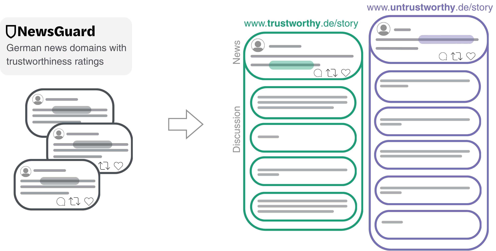
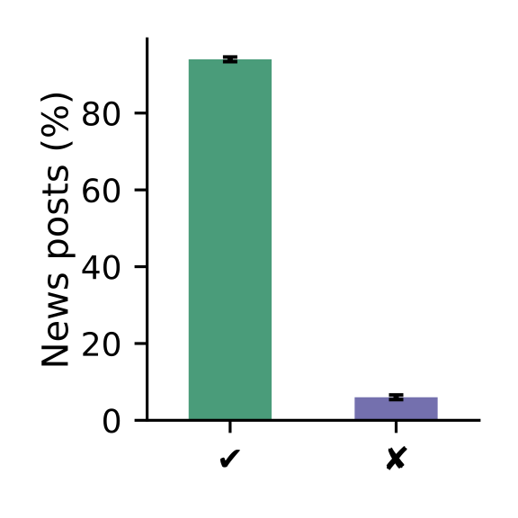
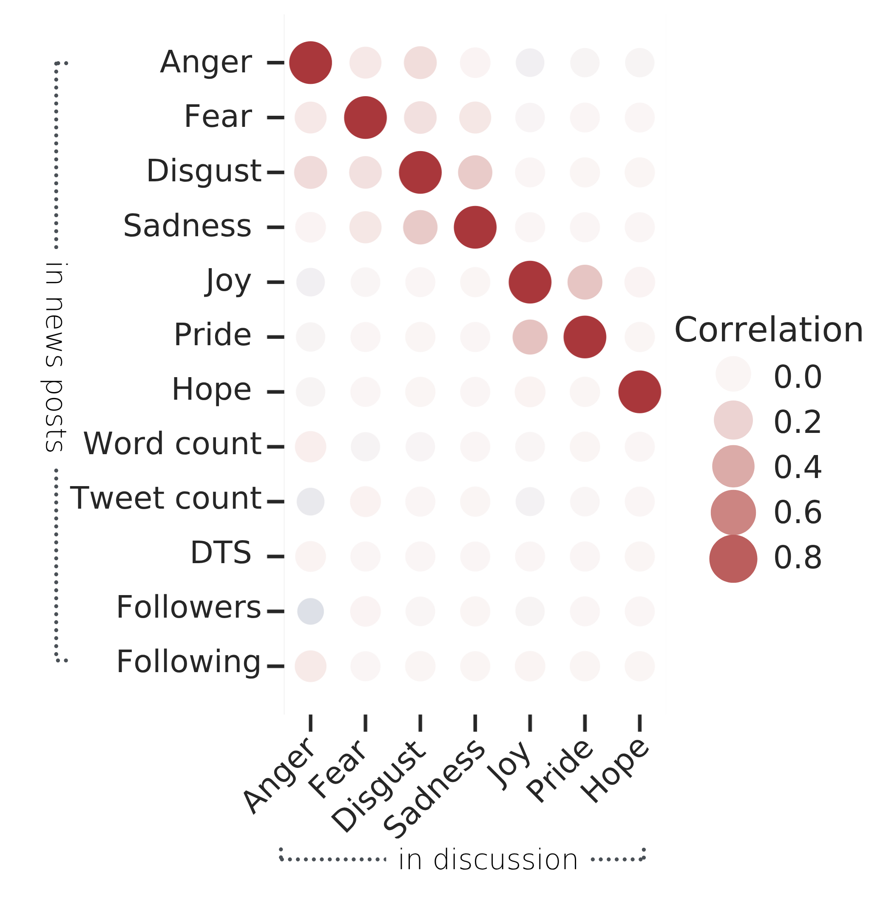
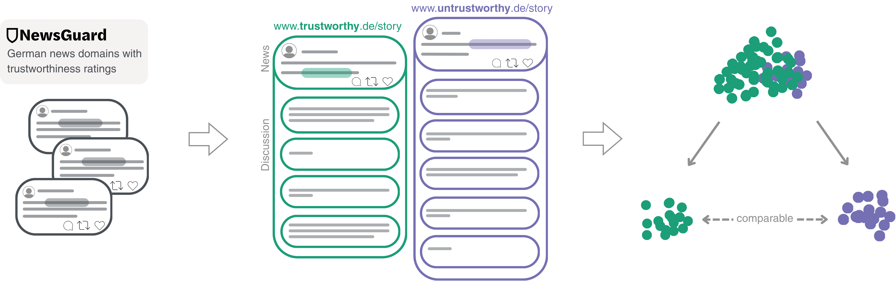
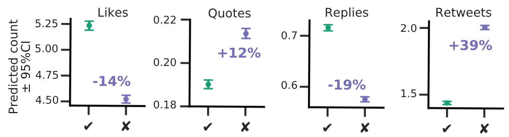
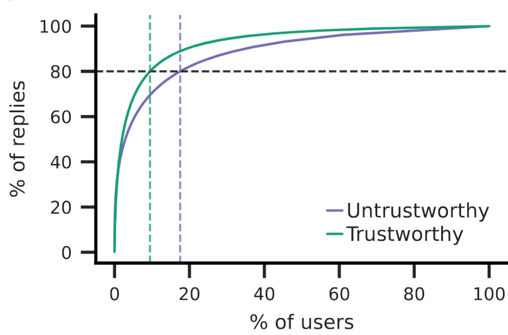
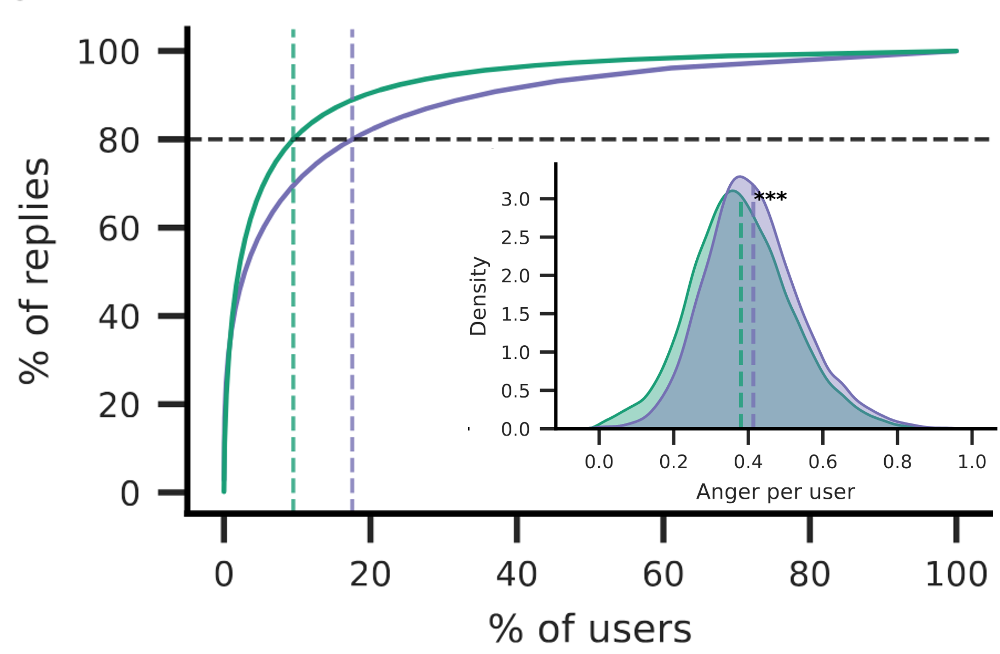

## The prevalence of misinformation on social media

::: columns

::: {.column width="50%"}

<br>

- Misinformation<sup>1</sup> makes up only a **small fraction** of shared and consumed news online<sup>2</sup>, 

- while being concentrated in politically extreme communities [@allenEvaluatingFakeNews2020; @baribi-bartovSupersharersFakeNews2024; @gonzalez-bailonDiffusionReachMisInformation2024]


::: fragment

$\rightarrow$ how **harmful** is misinformation on social media then?

:::

:::

::: {.column width="50%"}

![**Figure 1.** Exposure to elite misinformation is associated with sharing lower-quality outlets and with conservative estimated ideology [@moslehMeasuringExposureMisinformation2022].](figures/political-asymmetry.png){width="350" fig-align="right"}


:::

:::


::: footer
<sup>1</sup>=false information without intention to deceive [@wardleInformationDisorderInterdisciplinary2017]; <br>
<sup>2</sup>depending on measurement and topic [@scharfbilligFracturedReality2026]
:::


::: notes

- Numerous studies have documented that misinformation makes up only a small fraction of online news consumption, ranging from 0.1 to 20% depending on the topic and measurement

- However, when we look at the users who are exposed to it only, we typically see this banana shape, with right-wing and conservative users being exposed to or actively sharing misinformation

- This raises the question of how harmful misinformation is beyond prevalence 


:::

## Effects of misinformation beyond belief

::: columns

<br>

::: {.column width="45%"}


### Individual-level experiments show

- reinforces partisan (mis-)beliefs [@eckerPsychologicalDriversMisinformation2022]

- secondary effects on uncertainty and distrust [@vaccariDeepfakesDisinformationExploring2020]

- negative emotions and hate [@luhringEmotionsMisinformationStudies2024]


:::

::: {.column width="45%"}


::: fragment

### But they suffer from [low ecological validity]

- artificial stimuli [also because deliberate exposure raises ethical concerns,  @lazerMeaningfulMeasuresHuman2021]

- science-friendly samples [e.g., @luhringEmotionsMisinformationStudies2024]

- cannot capture group- or platform-level interactions [@bak-colemanMovingInformativeActionable2025]

:::

:::

:::

::: fragment

$\rightarrow$ study effects of misinformation where it spreads

:::


::: footer
<sup>1</sup>=based on circumplex model [@russellCircumplexModelAffect1980] and<br> constructivist view [@lindquistFunctionalArchitectureHuman2012; @leachSystemsViewEmotion2021]
:::

::: notes

-   And individual-level experiments have indeed shown that misinformation reinforces partisan beliefs, but also beyond belief has these secondary effects on distrust, negative emotions and hate

-   A major concern is then not just how many people believe misinformation but its secondary effects on democratic discourse

-   experiments give clean causal estimates but with artificial stimuli and samples, and they cannot reproduce group-level dynamics on platforms

-   also, exposing people to misinformation on purpose is ethically tricky


:::

## Effects of misinformation beyond exposure

<br>

::: columns

::: {.column width="50%"}

### Observational social media data shows misinformation

- overlaps with moral outrage and hate speech [@mcloughlinMisinformationExploitsOutrage2024; @moslehMisinformationHarmfulLanguage2024] $\rightarrow$ collective emotions<sup>1</sup> [@goldenbergCollectiveEmotions2020]

- gets engagement [@vosoughiSpreadTrueFalse2018; @juulComparingInformationDiffusion2021]
:::


::: {.column width="48%"}

::: fragment

### But it suffers from [low internal validity]

-  confounded by other source cues, hateful and sensationalist language, ...

    -  e.g., comparing fact-checked false stories to neutral news reports [@vosoughiSpreadTrueFalse2018]

:::

:::

:::

::: fragment
$\rightarrow$ calls to rethink causality and estimate effects **in the wild** [@lorenz-spreenSystematicReviewWorldwide2022; @budakMisunderstandingHarmsOnline2024; @tayCausalInferenceMisinformation2024] 
:::


::: notes

-   On social media, content that is highly arousing and negative gets higher engagement, typically, this is moralizing and conflictual content; misinformation exploits exactly this outrage

-   So we would also expect misinformation to be embedded in such emotional dynamics, anger, and intergroup hate

-   Moral outrage literature: it's not that people are feeling emotions individually, but they are expressing them collectively. So we're not interested in effects on individuals (could be bots too), but in what emerges in discussions and how other people then see it

-   "Group-level" / "platform-level" perspective on collective engagement: this is something we could not do in an experiment

-   observational data is great but we have little control and misinformation co-occurs with polarization, hate speech, and self-selected audiences

-   Several people have called for rethinking causality in this field
:::


# What are the effects of misinformation on (collective) online interactions?


## Data collection

<br>

- **Systematic and large-scale data set** for the German-speaking context: 9.9M news tweets, 11M replies (Oct 2020 -- Mar 2022)

{width="70%"} 


## Dataset descriptives


<br>

::: columns

::: {.column width="25%"}

{width="200" fig-align="left"}

<br>

<br>

- robust 6% of untrustworthy news

:::

::: {.column width="45%"}

::: fragment

![**Figure 4.** Probability of each news tweet containing each emotion (0-1), predicted by pol_emo_mDeBERTa2 [@widmannCreatingComparingDictionary2022].](figures/emotions_over_time.png){width="800"}

<br>

<br>

<br>

- anger and fear are overall higher across the whole observation period


:::

:::

::: {.column width="30%"}

::: fragment 


{width="400"}

- emotional spillover into the discussions


:::

:::

:::


## Data collection (2)

<br>

{width="95%"} 


## Matching as a middle ground

::: columns

::: {.column width="40%"}

<br>

- keeps the **naturalistic context** of platform data

- builds a **synthetic control group** comparable on observed confounders $\rightarrow$ blocks backdoor paths [@hoMatchingNonparametricPreprocessing2007; @pearlBookWhy2019]

:::

::: {.column width="60%"}

```{dot}
//| fig-width: 6
//| fig-height: 4.2
digraph DAG {
  graph [rankdir=LR, bgcolor="transparent", nodesep=0.2, ranksep=0.35, fontname="Source Code Pro"];
  node  [fontname="Source Code Pro", fontsize=15, shape=box, margin="0.35,0.12", height=0.8, style="rounded,filled", color="#003C78", penwidth=1.2];
  edge  [color="#555555", arrowsize=0.8, penwidth=1.3];

  // matched confounders (poster side)
  bias   [label="Political bias", fillcolor="#DCEBF7"];
  author [label="Author (followers,\n following, tweets)", fillcolor="#DCEBF7"];
  post   [label="Post (topic,word\ncount, emotions)", fillcolor="#DCEBF7"];

  // treatment, mediator, outcome
  T [label="Untrustworthy news", fillcolor="#8A2BE2", fontcolor="white", color="#8A2BE2"];
  Y [label="Engagement &\nreply emotions", fillcolor="#1E8CC8", fontcolor="white", color="#1E8CC8"];

  {rank=same; bias; author; post}

  bias -> T;   bias -> Y;
  author -> T; author -> Y;
  post -> T;   post -> Y;

  T -> Y [penwidth=2.2, color="#8A2BE2"];
}
```

[**Figure 7.** Directed Acylic Graph (DAG) with <span style="background:#DCEBF7;padding:0 4px">matched</span>; <span style="background:#8A2BE2;padding:0 4px">treatment</span>; <span style="background:#1E8CC8;padding:0 4px">outcome</span>.]{style="font-size:60%"}

:::

:::


::: notes

-   Matching as a middle ground: we keep the real-world context, but compare posts that are similar on the confounders we can observe

-   This rests on the assumption that, conditional on the covariates, assignment is as good as random.

:::


## Matching as a middle ground

::: columns

::: {.column width="40%"}

<br>

- keeps the **naturalistic context** of platform data

- builds a **synthetic control group** comparable on observed confounders $\rightarrow$ blocks backdoor paths [@hoMatchingNonparametricPreprocessing2007; @pearlBookWhy2019]

- evaluate performance based on differences

:::

::: {.column width="60%"}

<br>

![**Figure 8.** Matching with Nearest Neighbor and Mahalanobis distance [@hoMatchItNonparametricPreprocessing2025].](figures/mahalanobis_plot_all.png){width="100%"}


:::

:::


## Confounder-adjusted effects on engagement

<br>

{width="900"}

<br>

$\uparrow$ **more** retweets for tweets with untrustworthy news sources

$\downarrow$ but **fewer** likes & replies


## Confounder-adjusted effects on emotions

<br>

{width="800" fig-align="left"}

<br>

$\uparrow$ **more** anger, disgust and fear 

$\downarrow$ and **less** joy in response to untrustworthy sources

::: notes


:::

## Self-selection dynamics

::: columns

::: {.column width="38%"}

{width="600" fig-align="left"}

:::

::: {.column width="62%"}

:::

:::

::: notes

- most users replying to untrustworthy news posts also reply to trustworthy news but not vice versa

- while 9.6% of users wrote 80% of the replies to trustworthy news, only 2.1% wrote 80% of the replies to untrustworthy news.

:::


## Self-selection dynamics

::: columns

::: {.column width="38%"}

{width="600" fig-align="left"}


$\rightarrow$ angrier users preferentially engage, creating self-reinforcement
:::

::: {.column width="2%"}

:::

::: {.column width="60%"}

::: fragment

```{dot}
//| fig-width: 6
//| fig-height: 4.2
digraph DAG {
  graph [rankdir=LR, bgcolor="transparent", nodesep=0.2, ranksep=0.35, fontname="Source Code Pro"];
  node  [fontname="Source Code Pro", fontsize=15, shape=box, margin="0.35,0.12", height=0.8, style="rounded,filled", color="#003C78", penwidth=1.2];
  edge  [color="#555555", arrowsize=0.8, penwidth=1.3];

  // matched confounders (poster side)
  bias   [label="Political bias", fillcolor="#DCEBF7"];
  author [label="Author (followers,\n following, tweets)", fillcolor="#DCEBF7"];
  post   [label="Post (topic,word\ncount, emotions)", fillcolor="#DCEBF7"];

  // unobserved
  topic  [label="Unobserved", style="rounded,dashed", color="#888888", fontcolor="#666666"];

  // treatment, mediator, outcome
  T [label="Untrustworthy news", fillcolor="#8A2BE2", fontcolor="white", color="#8A2BE2"];
  M [label="Self-selection,\ncuration", fillcolor="white", color="#1E8CC8"];
  Y [label="Engagement &\nreply emotions", fillcolor="#1E8CC8", fontcolor="white", color="#1E8CC8"];

  {rank=same; bias; author; post; topic}

  bias -> T;   bias -> Y;
  author -> T; author -> Y;
  post -> T;   post -> Y;
  topic -> T [style=dashed, color="#888888"];
  topic -> Y [style=dashed, color="#888888"];

  T -> M -> Y [penwidth=2.2, color="#8A2BE2"];
}
```

[**Figure 12.** Directed Acylic Graph (DAG) with <span style="background:#DCEBF7;padding:0 4px">matched</span>; *dashed* = unobserved; <span style="color:#1E8CC8">**who replies**</span> = part of the effect, not matched.]{style="font-size:60%"}


:::

:::

:::


## Conclusion


- Sources with lower trustworthiness have lower reach overall $\rightarrow$ misinformation is a contained problem [@allenEvaluatingFakeNews2020]

    -   _But_ it spreads through reshares and quote reshares [in line with @guessHowSocialMedia2023's de-activation]


- Sources with low trustworthiness predict anger, disgust and fear expressions in following discussions [@mcloughlinMisinformationExploitsOutrage2024; @moslehMisinformationHarmfulLanguage2024]

    -   Most likely driven by a motivated minority with preferences for hostile content [@petersenNeedChaosMotivations2023; @robertsonUsersChooseEngage2023]
    
::: fragment 

> Limitations:<br>
> - **Source $\neq$ claim:** we estimate effects of source trustworthiness, not of false claims in single posts as well as excluding non-textual content [@nennoPoliticalDisinformationConcentrates2026];<br>
> - **Unobserved confounders:** topic, timing, algorithmic exposure $\rightarrow$ tweet-level topics, causal sensitivity analyses, debiasing;<br>
> - **Missing data:** deleted tweets and suspended accounts


::: 

::: notes


:::
      
## Thank you!

<br>

:::{.center}

{width="1000"}

:::

<br>

Email: [jula.luehring\@gesis.org](jula.luehring\@gesis.org)

Bluesky: [\@julaluehring.bsky.social](https://bsky.app/profile/julaluehring.bsky.social)

Website: [julaluehring.github.io](julaluehring.github.io)


## References
