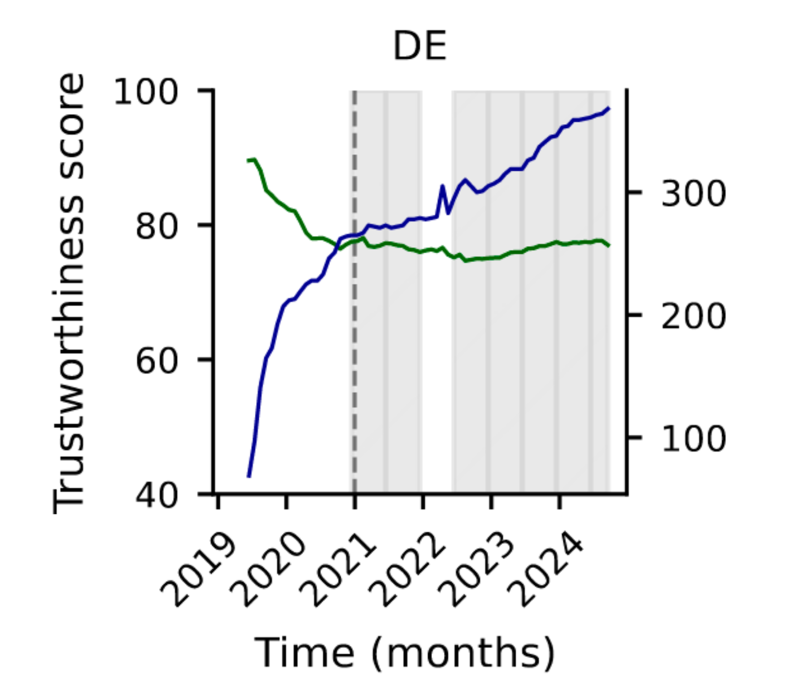
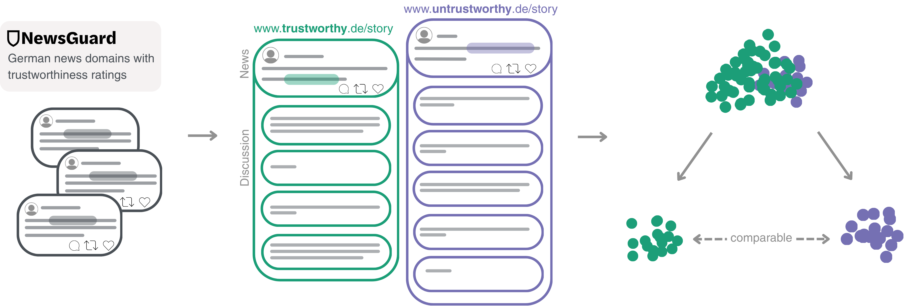
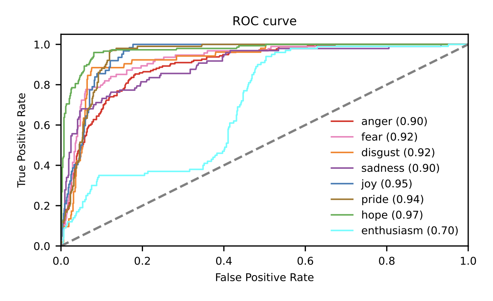

## Misinformation on social media

::: columns

::: {.column width="50%"}

<br>

- Misinformation<sup>1</sup> makes up only a **small fraction** of shared and consumed news online<sup>2</sup>, 

- while being concentrated and persistent in politically extreme communities [@allenEvaluatingFakeNews2020; @baribi-bartovSupersharersFakeNews2024; @gonzalez-bailonDiffusionReachMisInformation2024]


:::

::: {.column width="50%"}

![**Figure 1.** Exposure to elite misinformation is associated with sharing lower-quality outlets and with conservative estimated ideology [@moslehMeasuringExposureMisinformation2022].](figures/political-asymmetry.png){width="350" .right}


:::

:::

- Lack of causal evidence of its effects [@lorenz-spreenSystematicReviewWorldwide2022;  @budakMisunderstandingHarmsOnline2024; @tayCausalInferenceMisinformation2024] 

::: footer
<sup>1</sup>*=false information without intention to deceive*  [@wardleInformationDisorderInterdisciplinary2017]; <br>
<sup>2</sup>depending on measurement and topic [@scharfbilligFracturedReality2026]
:::


## Socio-affective dynamics online

::: columns

::: {.column width="50%"}

<br>

- Misinformation spreads in emotionally charged environments: moral outrage, affective polarization, intergroup conflict [@mcloughlinMisinformationExploitsOutrage2024; @moslehMisinformationHarmfulLanguage2024]

::: fragment

- Socio-affective dynamics relate to **collectively expressed** emotions<sup>1</sup> [@goldenbergCollectiveEmotions2020]

:::


:::

::: {.column width="50%"}

![**Figure 2.** Multilevel model of misinformation spread [ @frischlichComplexityMisinformationExtends2025].](figures/frischlichetal.png)

:::

:::

::: fragment
$\rightarrow$ effects of misinformation on social media therefore at the level of **discussions & communities**
:::


::: footer
<sup>1</sup>*=based on circumplex model [@russellCircumplexModelAffect1980] and<br> constructivist view [@lindquistFunctionalArchitectureHuman2012; @leachSystemsViewEmotion2021]*
:::

::: notes
-   On social media, arousing emotions attract attention and higher engagement, reflecting a function of emotions, namely grabbing attention

-   Content that is highly arousing and negative gets higher engagement, typically, this is moralizing and conflictual content; misinformation exploits exactly this outrage

-   So we would also expect misinformation to be embedded in such emotional dynamics, anger, and intergroup hate

-   Moral outrage literature: it's not that people are feeling emotions individually, but they are expressing them collectively. So we're not interested in effects on individuals (could be bots too), but in what emerges in discussions and how other people then see it

-   "Group-level" / "platform-level" perspective on collective engagement: this is something we could not do in an experiment

-   A major concern is then not just how many people believe misinformation but its secondary effects on discussions
:::

# What are the effects of misinformation on online interactions?


## Methodological implications

<br>

::: columns
::: {.column width="48%"}

### Misinformation sampling

- Fact-checked false stories are a sample of extreme cases [@vosoughiSpreadTrueFalse2018]
- Source ratings cover the broader spectrum of news quality and include gray-area content

$\rightarrow$ we study **source trustworthiness**, not the falsity of single posts

:::

::: {.column width="48%"}

::: fragment

### Causal identification

- Experiments: artificial stimuli, science-friendly samples, no group- or platform-level dynamics [@bak-colemanMovingInformativeActionable2025]; deliberate exposure raises ethical concerns [@lazerMeaningfulMeasuresHuman2021]

- Observational data: confounded by polarization, hate speech, and user self-selection

:::

:::
:::

::: fragment
$\rightarrow$ calls to rethink causality and estimate effects **in the wild**
:::


::: notes
We identified two problems that we wanted to tackle in this study

-   First, measurement: misinformation is often measured as clearly false, fact-checked instances, which is a sample of extreme cases and makes it hard to compare to real news. Source ratings cover the whole spectrum, but they are a proxy: Allen et al. show that domain-level methods miss misleading content from otherwise trusted outlets. So we are explicit that our treatment is source trustworthiness, not whether a single post is false

-   Second, identification: experiments give clean causal estimates but with artificial stimuli and samples, and they cannot reproduce group-level dynamics on platforms. Also, exposing people to misinformation on purpose is ethically tricky. Observational data has the real thing, but misinformation co-occurs with polarization, hate speech, and self-selected audiences

-   Several people have called for rethinking causality in this field
:::

## Matching as a middle ground

::: columns
::: {.column width="40%"}

<br>

- Keeps the **naturalistic context** of platform data

- Instead of randomizing users, builds a **synthetic control group** comparable on observed confounders $\rightarrow$ blocks backdoor paths [@hoMatchingNonparametricPreprocessing2007; @pearlBookWhy2019]

- **Limitation:** we only adjust for what we observe
:::

::: {.column width="60%"}

```{dot}
//| fig-width: 6
//| fig-height: 4.2
digraph DAG {
  graph [rankdir=LR, bgcolor="transparent", nodesep=0.2, ranksep=0.35, fontname="Source Code Pro"];
  node  [fontname="Source Code Pro", fontsize=15, shape=box, margin="0.35,0.12", height=0.8, style="rounded,filled", color="#003C78", penwidth=1.2];
  edge  [color="#555555", arrowsize=0.8, penwidth=1.3];

  // matched confounders (poster side)
  bias   [label="Source bias", fillcolor="#DCEBF7"];
  author [label="Author (followers,\n following, tweets)", fillcolor="#DCEBF7"];
  post   [label="Post (topic,word\ncount, emotions)", fillcolor="#DCEBF7"];

  // unobserved
  topic  [label="Unobserved", style="rounded,dashed", color="#888888", fontcolor="#666666"];

  // treatment, mediator, outcome
  T [label="Untrustworthy\nsource", fillcolor="#8A2BE2", fontcolor="white", color="#8A2BE2"];
  M [label="Self-selection,\ncuration", fillcolor="white", color="#1E8CC8"];
  Y [label="Engagement &\nreply emotions", fillcolor="#1E8CC8", fontcolor="white", color="#1E8CC8"];

  {rank=same; bias; author; post; topic}

  bias -> T;   bias -> Y;
  author -> T; author -> Y;
  post -> T;   post -> Y;
  topic -> T [style=dashed, color="#888888"];
  topic -> Y [style=dashed, color="#888888"];

  T -> M -> Y;
  T -> Y [penwidth=2.2, color="#8A2BE2"];
}
```

[**Figure 3.** Directed Acylic Graph (DAG) with <span style="background:#DCEBF7;padding:0 4px">matched</span>; *dashed* = unobserved; <span style="color:#1E8CC8">**who replies**</span> = part of the effect, not matched.]{style="font-size:60%"}

:::
:::


::: notes
-   Matching as a middle ground: we keep the real-world context, but compare posts that are similar on the confounders we can observe
-   Be clear about the estimand: source trustworthiness, at the level of news tweets and their discussions
-   This rests on the assumption that, conditional on the covariates, assignment is as good as random. So each covariate needs a justification: is it a common cause (confounder), part of the pathway (mediator), or affected by both treatment and outcome (collider)?
-   Example: emotion in the news tweet itself is plausibly a mediator, so we separate stimulus emotions from reply emotions
:::

## Data collection

<br>

::: {.fragment style="position: absolute; top: 120px; left: 0px; width: 220px; z-index: 10; background: white;"}

{width="200"}

:::

{width="1500"} 


$\rightarrow$ **Systematic and large-scale data set** for the German-speaking context: 9.9M news tweets, 11M replies (Oct 2020 -- Mar 2022)


## Dataset descriptives

::: columns

::: {.column width="65%"}

<br>

![**Figure 5.** Probability of each tweet containing each emotion (0-1), predicted by pol_emo_mDeBERTa2 [@widmannCreatingComparingDictionary2022].](figures/emotions_over_time.png){width="800"}

:::

::: {.column width="35%"}

{width="200"}

- robust 6% of untrustworthy news

- anger and fear are overall higher across the whole observation period

:::

:::


## Dataset descriptives

::: columns

::: {.column width="65%"}

<br>


{width="500"}

$\rightarrow$ enthusiam was excluded due to low performance

:::

::: {.column width="35%"}

{width="200"}

- robust 6% of untrustworthy news 

- anger and fear are overall higher across the whole observation period

:::

:::


::: notes
-   For each tweet, we then classified 8 distinct emotions from text
-   This plot shows the covered time frame from October 2020 to March 2022 and we can already see that anger is overall much higher
:::

## Non-parametric matching

<br>


::: columns

::: {.column width="50%"}

{width="400"}


:::

::: {.column width="50%"}
::: fragment
![**Figure 9.** Matching with Nearest Neighbor and Mahalanobis distance [@hoMatchItNonparametricPreprocessing2025].](figures/mahalanobis_plot_all.png){width="500"}

$\rightarrow$ matching mitigates emotional spillover

:::
:::
:::


## Effects on engagement

<br>

{width="900"}

$\uparrow$ **more** retweets for tweets with untrustworthy news sources

$\downarrow$ but **fewer** likes & replies


## Effects on emotions

<br>

{width="800" fig-align="left"}


$\uparrow$ **more** anger, disgust and fear 

$\downarrow$ and **less** joy in response to untrustworthy sources

::: notes
- most users replying to untrustworthy news posts also reply to trustworthy news but not vice versa. While 9.6% of
users wrote 80% of the replies to trustworthy news, only 2.1% wrote 80% of the replies to untrustworthy news.
:::

## Self-selection dynamics

::: columns

::: {.column width="75%"}

{width="600" fig-align="left"}

:::

::: {.column width="25%"}

:::

:::


## Self-selection dynamics

::: columns

::: {.column width="75%"}

{width="600" fig-align="left"}

:::

::: {.column width="25%"}

:::

:::

$\rightarrow$ Angrier users preferentially engage, creating self-reinforcement

## Conclusion

-   Sources with lower trustworthiness have lower reach $\rightarrow$ misinformation is a contained problem [@allenEvaluatingFakeNews2020]

    -   **_But_** it spreads through reshares and quote reshares [in line with @guessHowSocialMedia2023's de-activation]

-   Sources with low trustworthiness predict anger, disgust and fear expressions in following discussions [@mcloughlinMisinformationExploitsOutrage2024; @moslehMisinformationHarmfulLanguage2024]

-   Effects are probably limited on a motivated minority with preferences for hostile content [@petersenNeedChaosMotivations2023; @robertsonUsersChooseEngage2023]


::: fragment 

> Limitations:<br>
> - **Source $\neq$ claim:** we estimate effects of source trustworthiness, not of false claims in single posts as well as excluding non-textual content [@nennoPoliticalDisinformationConcentrates2026];<br>
> - **Unobserved confounders:** topic, timing, algorithmic exposure $\rightarrow$ tweet-level topics, sensitivity analyses;<br>
> - **Missing data:** deleted tweets and suspended accounts


::: 

::: notes
- These come largely from the peer review of the paper, and they are general problems for matching with platform data
- Source vs content: domain ratings are a proxy; the estimand is the source label, not the falsity of the individual post
- Matching only adjusts for what we observe. Topic is the obvious candidate, so we classify topics at the tweet level instead of relying on source-level topics
- Follower/following/tweet counts come from the API at collection time, not at posting time. If misinformation posts grow an author's audience, we would be conditioning on something downstream of the treatment
- Within-user comparisons show that anger is partly selection, but selection can come from users or from the feed algorithm
:::
      
## Thank you!

<br>

:::{.center}

{width="1000"}

:::

<br>

Email: [jula.luehring\@gesis.org](jula.luehring\@gesis.org)

Bluesky: [\@julaluehring.bsky.social](https://bsky.app/profile/julaluehring.bsky.social)

Website: [julaluehring.github.io](julaluehring.github.io)


## References
